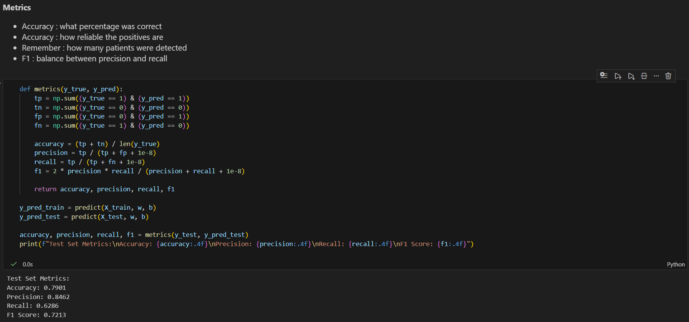

# Heart Disease Risk Prediction : Logistic Regression
----
## Introductory Context

Heart disease is the leading cause of death worldwide, claiming approximately 18 million lives each year, the World Health Organization reports. Predictive models such as logistic regression may allow early identification of patients at risk by analyzing clinical characteristics such as age, cholesterol, and blood pressure. This not only improves treatment outcomes but also optimizes resource allocation in healthcare settings. In this repository, logistic regression is implemented on the Heart Disease dataset, a real-world UCI repository collection of 303 patient records with 14 features and a binary objective (1 for presence of disease, 0 for absence). We'll train models, visualize boundaries, apply regularization, and explore deployment through Amazon SageMaker to mimic a production process.

In this project, logistic regression is implemented from scratch to predict the presence of heart disease using clinical variables such as age, blood pressure, cholesterol, and exercise-related measurements. The goal is not only prediction, but also to understand the learning process through optimization, visualization and regularization.

## Dataset Description.

The dataset used is the Heart Disease Dataset from Kaggle: https://www.kaggle.com/datasets/neurocipher/heartdisease

- Number of samples: 303 patients
- Target variable: Heart Disease
    - 1 : Presence
    - 0 : Absence
- Features include:
    - Age (29–77 years)
    - Blood Pressure (BP)
    - Cholesterol (112–564 mg/dL)
    - Maximum Heart Rate
    - ST Depression
    - Number of vessels observed
Approximately 55% of the patients show presence of heart disease
The dataset was downloaded manually from Kaggle and loaded into the notebook using Pandas.
----
## Getting Started

These instructions explain how to run the project locally and reproduce the experiments.

### Prerequisites

You need the following installed :
- Python 3.8+
- Jupyter Notebook or Jupyter Lab
- pip

Python Libraries:


```{Python}
    numpy 
    pandas
    matplotlib

```

Install them using :

```{Phyton}
%pip install numpy pandas matplotlib
```

### Installing

1. Clone this repository :

```
git clone https://github.com/Rogerrdz/Heart-Disease-Risk-Prediction.git
```
2. Go to the project folder:

```
cd Heart-Disease-Risk-Prediction

```
3. Start Jupyter Notebook:

```
jupyter notebook

```

4. Open and Run the jupyter file :

```
heart_disease_lr_analysis.ipynb

```

All cells should execute without errors and generate plots and metrics
----

## Running the tests

Validation is done trough :
- Cost vs Iterations plots
- Train/Test  performance metrics
- Visual inspection

### End-to-end validation

The full pipeline validates:

  - Correct gradient descent convergence
  - Reasonable classification metrics
  - Stable behavior with different learning rates and regularization values
  


### And coding style tests

The implementation follows a clear and educational structure:

- Separate functions for sigmoid, cost, gradients, and training
- Vectorized operations using NumPy
- Markdown explanations for every step

## Deployment

The notebook was executed on Amazon SageMaker Studio using the free tier.

Process followed:
1. Created a SageMaker Studio environment.
2. Uploaded the notebook and dataset.
3. Ran all cells successfully inside SageMaker.
4. Trained the logistic regression model.
5. Exported model parameters (w and b).
6. Tested inference using sample patient data.

**Inference example:**

Input: Age=60, Cholesterol=300

Output: Probability = 0.68 → High risk

### Evidence

The repository includes screenshots showing:
SageMaker training notebook execution
Endpoint configuration
Inference response output

## Built With

- Python
- NumPy
- Pandas
- Matplotlib
- Amazon SageMaker

## Contributing

Please read [CONTRIBUTING.md](https://gist.github.com/PurpleBooth/b24679402957c63ec426) for details on our code of conduct, and the process for submitting pull requests to us.

## Versioning

We use [SemVer](http://semver.org/) for versioning. For the versions available, see the [tags on this repository](https://github.com/Rogerrdz/Heart-Disease-Risk-Prediction.git). 

## Authors

* **Billie Thompson** - *Initial work* - [PurpleBooth](https://github.com/PurpleBooth)

See also the list of [contributors](https://github.com/your/project/contributors) who participated in this project.

## Acknowledgments

* Hat tip to anyone whose code was used
* Inspiration
* etc